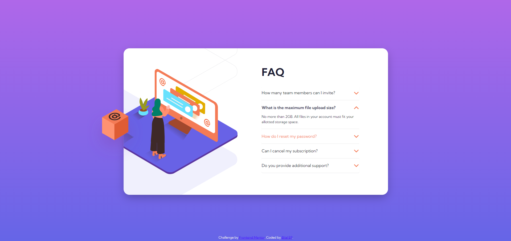

# Frontend Mentor - FAQ accordion card solution

This is a solution to the [FAQ accordion card challenge on Frontend Mentor](https://www.frontendmentor.io/challenges/faq-accordion-card-XlyjD0Oam). Frontend Mentor challenges help you improve your coding skills by building realistic projects. 

## Table of contents

- [Overview](#overview)
  - [The challenge](#the-challenge)
  - [Screenshot](#screenshot)
  - [Links](#links)
- [My process](#my-process)
  - [Built with](#built-with)
  - [What I learned](#what-i-learned)
  - [Continued development](#continued-development)
- [Author](#author)


## Overview

### The challenge

Users should be able to:

- View the optimal layout for the component depending on their device's screen size
- See hover states for all interactive elements on the page
- Hide/Show the answer to a question when the question is clicked

### Screenshot


### Hovered states Screenshot


### Links

- Solution URL: [Add solution URL here](https://github.com/bilalep/Accordion-Challenge)
- Live Site URL: [Add live site URL here](https://bilalep.github.io/Accordion-Challenge/)

## My process

### Built with

- Semantic HTML5 markup
- CSS custom properties
- Bootstrap

### What I learned

```html
<h1>Some HTML code I'm proud of</h1>
```
```css
.proud-of-this-css {
  color: papayawhip;
}
```

### Continued development

- Flexbox
- CSS grid
- Animations
- Pseudo classes and elements

## Author

- Website - [Bilal EP](https://www.your-site.com)
- Frontend Mentor - [@bilalep](https://www.frontendmentor.io/profile/bilalep)
- Twitter - [@epbilal0942](https://twitter.com/epbilal0942)
